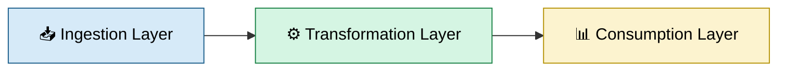

# **Pharma Commercial Analytics Platform**
## **Overview**

This project demonstrates the design and implementation of a production-style Data Engineering solution on Snowflake for pharmaceutical commercial analytics.

The platform ingests healthcare provider (HCP), patient enrollment, and prescription datasets from AWS S3 into Snowflake, applies automated transformations using Streams and Tasks, and delivers business-ready metrics for reporting and analysis.

## **Business Problem**

Pharmaceutical organizations rely on multiple data sources to track commercial performance. This project centralizes provider, enrollment, and prescription data to provide insights into:

Total Enrollments
New Enrollments
Total TRx
Total NRx
HCPs with New Enrollments
Territory Performance
Specialty Performance

## Solution Architecture

## Technology Stack by Layer

```mermaid
flowchart TB

    A[📥 Ingestion Layer]

    A --> A1[AWS S3]
    A --> A2[Snowflake Stage]
    A --> A3[Snowpipe]
    A --> A4[CSV Files]
    A --> A5[Metadata Tracking]

    B[⚙️ Transformation Layer]

    B --> B1[RAW Layer]
    B --> B2[CURATED Layer]
    B --> B3[Streams]
    B --> B4[Tasks]
    B --> B5[SQL Transformations]
    B --> B6[Data Quality Checks]
    B --> B7[Incremental Processing]

    C[📊 Consumption Layer]

    C --> C1[Tableau]
    C --> C2[Power BI]
    C --> C3[Business Users]

    classDef ingest fill:#D6EAF8,stroke:#1F618D,color:#000;
    classDef transform fill:#D5F5E3,stroke:#1E8449,color:#000;
    classDef consume fill:#FCF3CF,stroke:#B7950B,color:#000;

    class A,A1,A2,A3,A4,A5 ingest;
    class B,B1,B2,B3,B4,B5,B6,B7 transform;
    class C,C1,C2,C3 consume;
```

## **Technology Stack**

  Snowflake
  AWS S3
  Snowpipe
  Streams
  Storage Integration
  File Format
  Tasks
  SQL
  Tableau
  GitHub
  

## Data Layers

### RAW Layer
- Stores source files in their original format.
- Preserves complete source data for auditing and reprocessing.

### CURATED Layer
- Applies cleansing, standardization, and business rules.
- Creates analytics-ready datasets.

### MART Layer
- Provides reporting-ready datasets.
- Calculates business KPIs and aggregates.

## Project Goals

- Build a scalable cloud-native data pipeline
- Demonstrate Snowflake Data Engineering concepts
- Implement automated ingestion and transformation workflows
- Deliver pharma commercial analytics KPIs

## Future Enhancements

- dbt Integration
- Data Quality Framework
- CI/CD Pipeline
- Snowpark Transformations
- Monitoring & Alerting
