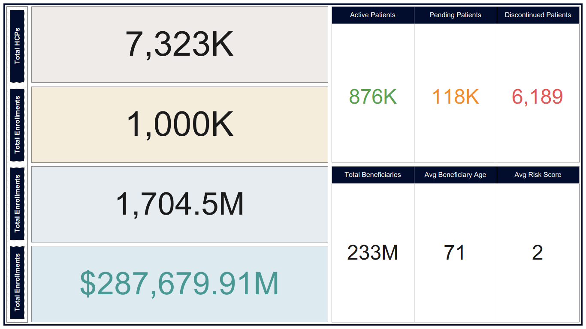
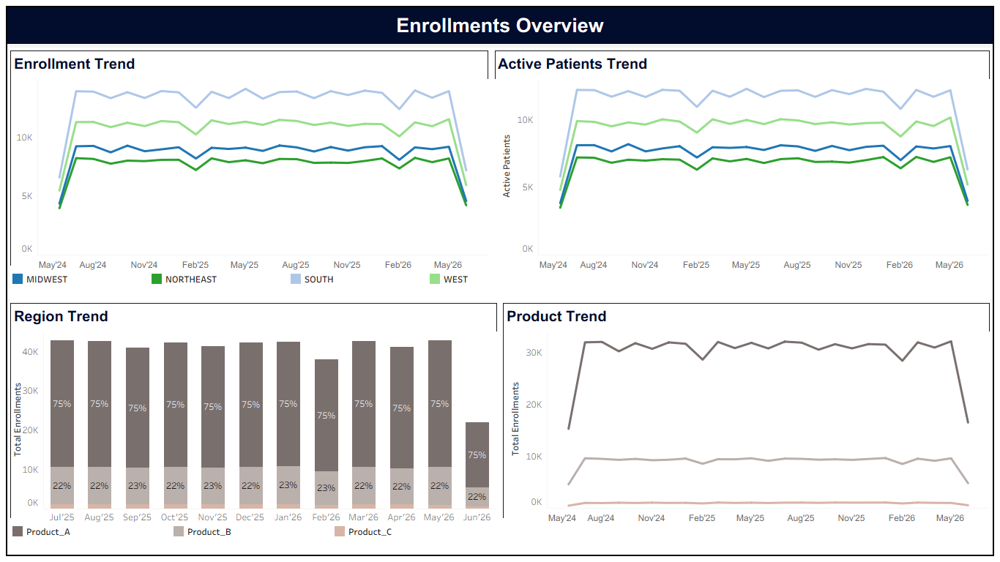
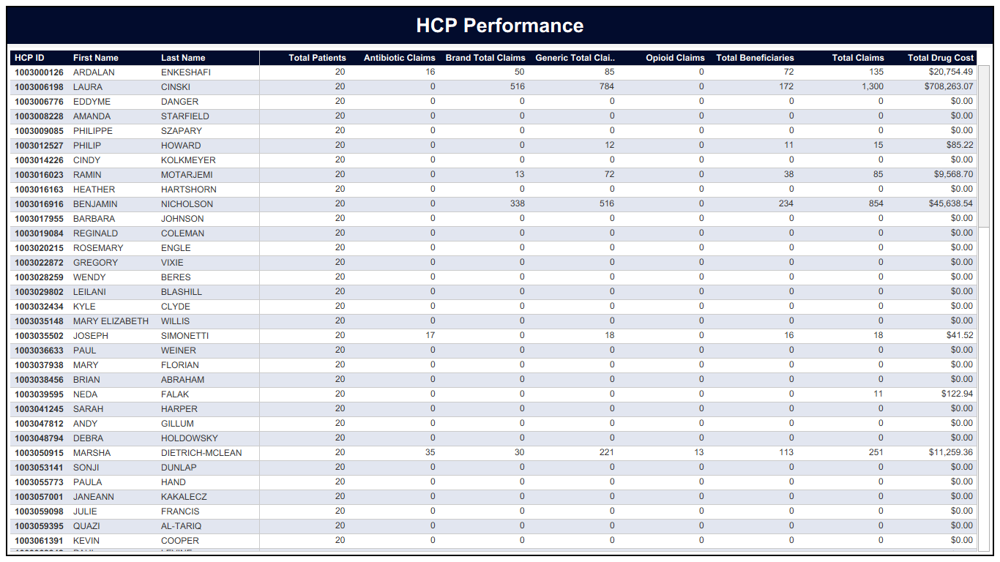
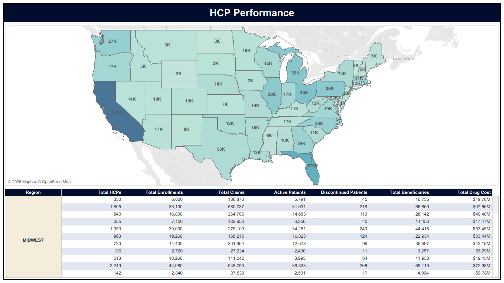

# Pharma Commercial Analytics Platform

## Overview

The Pharma Commercial Analytics Platform is an end-to-end cloud-native data engineering and analytics solution built on AWS S3, Snowflake, and Tableau.

The platform ingests healthcare provider, prescription, taxonomy, and enrollment datasets into Snowflake, applies business transformations through a multi-layer architecture, and delivers analytics-ready data marts for reporting and dashboard consumption.

The project demonstrates modern Data Engineering, Data Modeling, Analytics Engineering, and Business Intelligence concepts using real-world healthcare datasets.

---

## Business Problem

Pharmaceutical organizations require a centralized analytics platform to monitor:

- Healthcare Provider (HCP) performance
- Patient enrollments
- Prescription activity
- Product adoption
- Regional performance
- Commercial KPIs

The objective of this project is to build a scalable analytics platform that transforms raw healthcare datasets into actionable business insights.

---

## Architecture
```text
┌─────────────────────────────────────────────────────────────┐
│                    SOURCE DATASETS                          │
├─────────────────────────────────────────────────────────────┤
│                                                             │
│  Medicare Part D RX Data                                    │
│  NPPES HCP Master Data                                      │
│  NUCC Taxonomy Data                                         │
│  Enrollment Data                                            │
│                                                             │
└─────────────────────────────┬───────────────────────────────┘
                              │
                              ▼
┌─────────────────────────────────────────────────────────────┐
│                         AWS S3                              │
├─────────────────────────────────────────────────────────────┤
│                                                             │
│  Raw/RX                                                     │
│  Raw/HCP                                                    │
│  Raw/Taxonomy                                               │
│  Raw/Enrollment                                             │
│                                                             │
└─────────────────────────────┬───────────────────────────────┘
                              │
                              ▼
┌─────────────────────────────────────────────────────────────┐
│                    SNOWFLAKE LANDING                        │
├─────────────────────────────────────────────────────────────┤
│                                                             │
│  External Stages                                            │
│  File Formats                                               │
│  COPY INTO Operations                                       │
│                                                             │
└─────────────────────────────┬───────────────────────────────┘
                              │
                              ▼
┌─────────────────────────────────────────────────────────────┐
│                  FOUNDATION LAYER                           │
├─────────────────────────────────────────────────────────────┤
│                                                             │
│  F_HCP_MASTER                                               │
│  F_RX                                                       │
│  F_TAXONOMY                                                 │
│  F_ENROLLMENT                                               │
│                                                             │
└─────────────────────────────┬───────────────────────────────┘
                              │
                              ▼
┌─────────────────────────────────────────────────────────────┐
│                    CURATED LAYER                            │
├─────────────────────────────────────────────────────────────┤
│                                                             │
│  DIM_HCP                                                    │
│  DIM_PRODUCT                                                │
│  DIM_TARGET_HCP                                             │
│                                                             │
│  FACT_ENROLLMENT                                            │
│  FACT_RX                                                    │
│                                                             │
└─────────────────────────────┬───────────────────────────────┘
                              │
                              ▼
┌─────────────────────────────────────────────────────────────┐
│                   ANALYTICS LAYER                           │
├─────────────────────────────────────────────────────────────┤
│                                                             │
│  EXECUTIVE_KPI_SUMMARY                                      │
│  HCP_PERFORMANCE                                            │
│  STATE_PERFORMANCE                                          │
│  PRODUCT_PERFORMANCE                                        │
│  SPECIALTY_PERFORMANCE                                      │
│  MONTHLY_TRENDS                                             │
│                                                             │
└─────────────────────────────┬───────────────────────────────┘
                              │
                              ▼
┌─────────────────────────────────────────────────────────────┐
│                    CONSUMPTION LAYER                        │
├─────────────────────────────────────────────────────────────┤
│                                                             │
│  Tableau Dashboards                                         │
│  Power BI Reports                                           │
│  Business Users                                             │
│                                                             │
└─────────────────────────────────────────────────────────────┘
```
---

## Technology Stack

| Component | Technology |
|------------|------------|
| Cloud Storage | AWS S3 |
| Data Warehouse | Snowflake |
| Data Processing | SQL |
| Analytics Layer | Snowflake |
| Visualization | Tableau |
| Version Control | GitHub |

---

## Data Layers

### Landing Layer

Stores source files received from external systems.

### Foundation Layer

Stores raw data with minimal transformation.

### Curated Layer

Applies standardization, enrichment, and business rules.

### Analytics Layer

Creates reporting-ready data marts and KPI datasets.

---

## Data Sources

### HCP Master

National Provider Identifier (NPI) data containing provider demographics and taxonomy information.

### Medicare Prescription Data

Provider-level prescription activity and utilization metrics.

### Taxonomy Data

Healthcare provider taxonomy classifications and specialties.

### Enrollment Data

Synthetic patient enrollment dataset generated for commercial analytics use cases.

---

## Analytics Data Marts

### HCP_PERFORMANCE

Provider-level performance metrics.

### EXECUTIVE_KPI_SUMMARY

Enterprise KPI summary metrics.

### STATE_PERFORMANCE

State and regional performance metrics.

### SPECIALTY_PERFORMANCE

Specialty and classification level analytics.

### PRODUCT_PERFORMANCE

Product adoption and enrollment metrics.

### MONTHLY_TRENDS

Monthly enrollment and growth trends.

---

## Key KPIs

### Enrollment KPIs

- Total Enrollments
- Active Patients
- Pending Patients
- Discontinued Patients

### Prescription KPIs

- Total Claims
- Total Drug Cost
- Total Beneficiaries
- Total 30-Day Fills

### HCP KPIs

- Total HCPs
- Top Performing HCPs
- Claims by HCP

### Geography KPIs

- State Performance
- Regional Performance
- Enrollment Distribution

---

## Dashboard Pages

### Executive Overview

Enterprise KPI dashboard.



### Enrollment Analytics

Enrollment trends and product adoption.



### HCP Performance

Provider-level commercial performance.



### Geography Analytics

State and regional insights.



---

## Repository Structure

```text
pharma-commercial-analytics-platform/
├── architecture/
├── docs/
├── sql/
│   ├── 01_create_database_objects.sql
│   ├── 02_create_foundation_tables.sql
│   ├── 03_load_foundation_tables.sql
│   ├── 04_generate_enrollment_data.sql
│   ├── 05_create_curated_layer.sql
│   └── 06_create_analytics_layer.sql
└── README.md
```

## Future Enhancements

Snowpipe Automation

Streams & Tasks

Data Quality Framework

CI/CD Integration

dbt Integration

Snowpark Transformations

Monitoring & Alerting
